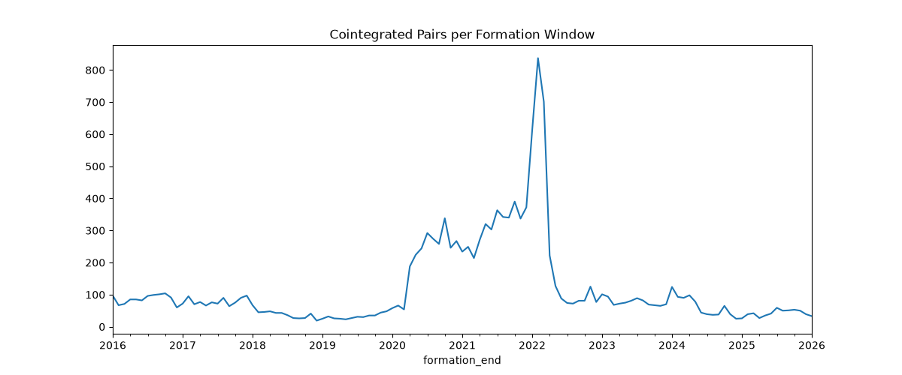
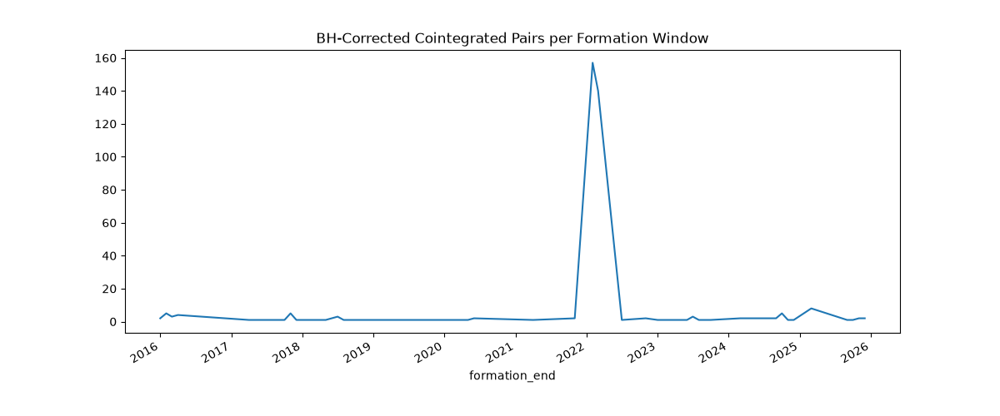
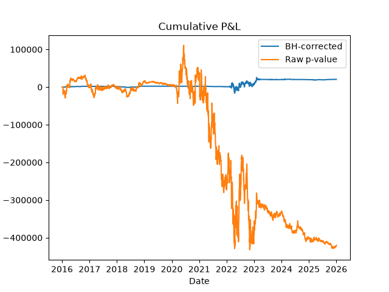

# Pairs Trading Statistical Backtest

A Python backtesting framework for evaluating a statistical arbitrage
pairs-trading strategy on historical equity data.

## Overview

This project identifies potentially cointegrated stock pairs during a
formation period, constructs a mean-reverting spread, and simulates trading
over subsequent out-of-sample periods.

The backtest includes transaction costs, position sizing, leverage tracking,
and performance metrics such as Sharpe ratio and maximum drawdown.

## Strategy

1. Select candidate stock pairs.
2. Test pairs for cointegration during the formation window.
3. Estimate the hedge ratio and spread.
4. Standardize the spread using a z-score.
5. Enter positions when the spread exceeds an entry threshold.
6. Exit when the spread mean-reverts or another exit condition is reached.
7. Repeat using rolling/walk-forward formation and trading windows.

## Backtesting Methodology

- Historical OHLCV data: [describe data source] https://github.com/pierrebrunelle/sp500-historical-constituents?utm_source=chatgpt.com
- Formation period: [your value]
- Trading period: [your value]
- Transaction costs: [your value]
- Execution assumptions: [e.g. trades executed at next day's open]
- Position sizing: [brief explanation]

## Performance Metrics

The backtest calculates:

- Cumulative P&L
- Sharpe ratio
- Maximum drawdown
- Peak leverage
- Number of trades
- [anything else you ultimately kept]

## Results

[Put your important results here.]

Example:

| Metric | Strategy | Benchmark |
|---|---:|---:|
| Cumulative P&L | ... | ... |
| Sharpe Ratio | ... | ... |
| Maximum Drawdown | ... | ... |
| Peak Leverage | ... | ... |

### Cointegrated Pairs with Raw P-Values



### Cointegrated Pairs with Benjamini-Hochberg Correction



### Equity Curve



## Project Structure

```text
SnP500-Pairs-Trading-Backtest/
├── assets/                             # Output graphs
│   ├── bh_cointegrated_pairs.png
│   ├── bh_vs_raw_cummulative_pnl.png
│   └── raw_cointegrated_pairs.png
├── data/                               # Not tracked in Git
│   ├── membership_snapshots/           # Monthly historical S&P 500 membership records
│   ├── bh_corrected_results.parquet    # BH-corrected cointegrated pairs dataset
│   ├── cointegration_results.parquet   # All cointegration results
│   ├── historical_ohlcv_df.parquet     # Historical monthly OHLCV data for S&P tickers
│   ├── membership_df.csv               # Formatted CSV of historical S&P membership data
│   └── sig_results.parquet             # Raw p-values cointegrated pairs dataset
├── .env
├── .gitignore
├── 01_data_collection.ipynb            # Notebook for generating required data files
├── 02_cointegration_testing.ipynb      # Notebook for identifying cointegrated pairs
├── 03_strategy_backtest.ipynb          # Notebook for backtesting and generating statistics/graphs
├── README.md
└── requirements.txt
```

## Installation

## Usage

## Limitations

## Future Improvements

## Technologies